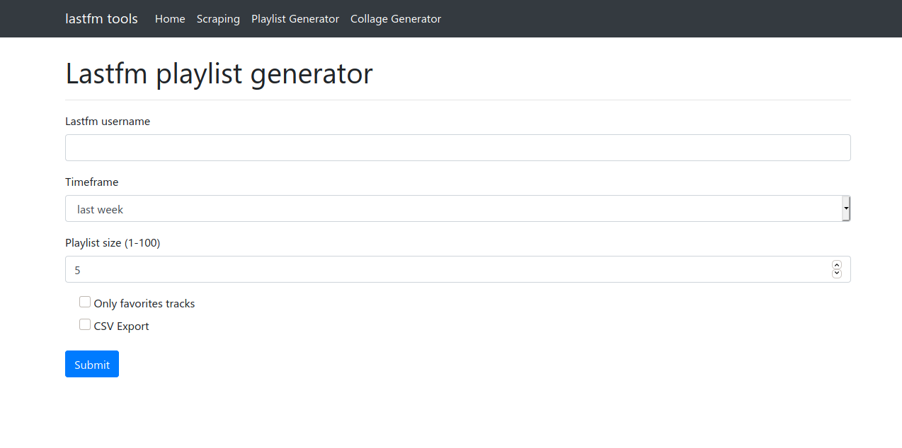

# django-lastfm

<a href="pictures/image.png"></a>

Simple django site acting as a frontend for:

- [lastfm_cg](https://github.com/dbeley/lastfm_cg): Lastfm collage generator
- [lastfm_pg](https://github.com/dbeley/lastfm_pg): Lastfm playlist generator
- [lastfm-scraper](https://github.com/dbeley/lastfm-scraper): Some lastfm scripts

## Secrets

To run the website, you will need some config files.

### secret.ini
```
[django]
SECRET_KEY = secret_key_here
```

### config_lastfm.ini
```
[lastfm]
username=username_here
api_key=api_key_here
api_secret=api_secret_here
```

### .env file

```
REDIS_URLS=redis://domain.tld
# optional, for docker + traefik
DEFAULT_NETWORK=traefik-network
DOMAIN=domain.tld
ALLOWED_HOSTS='127.0.0.1 localhost domain.tld'
```

### Environment variables

If you can't use ini files (i.e. when deploying with heroku), you can use those environment variables:

- `PYLAST_USERNAME`
- `PYLAST_API_KEY`
- `PYLAST_API_SECRET`
- `DJANGO_SECRET_KEY`
- `REDIS_URL`

